# Netty流量整形

## 概述

在实际生活中我们可能会因为某些原因需要控制服务端的读写速率，根据业务需求对不同的用户提供不同的下载速度，Netty本身也提供了高低水位和流量整形，两种方式来控制流量。


### 高低水位

netty中的高低水位机制会在发送缓冲区的数据超过高水位时触发channelWritabilityChanged事件同时将channel的写状态设置为false，但是这个写状态只是程序层面的状态，程序还是可以继续写入数据。所以使用这个机制时需要自行判断是否可写，并做相应的处理


### 流量整形

netty提供了ChannelTrafficShapingHandler、GlobalTrafficShapingHandler、GlobalChannelTrafficShapingHandler三个流量整形处理器，依次用于控制单个channel、所有channel、所有channel。这些处理器控制流量的原理相同的。控制读取速度是通过先从TCP缓存区读取数据，然后根据读取的数据大小和读取速率的限制计算出，需要暂停读取数据的时间。这样从平均来看读取速度就被降低了。控制写速度则是根据数据大小和写出速率计算出预期写出的时间，然后封装为一个待发送任务放到延迟消息队列中，同时提交一个延迟任务查看消息是否可发送了。这样从平均来看每秒钟的数据读写速度就被控制在读写限制下了


## 高低水位机制的实现

 netty通过一个ChannelPipeline维护了一个双向链表，当触发Inbound事件时事件会从head传播到tail，而Outboud事件则有两种传播方式，一是从当前handler传播到head、二是从tail传播到head。使用哪种传播方式取决于你是通过ChannelHandlerContext直接发送数据还是通过channel发送数据。
当我们在netty中使用write方法发送数据时，这个数据其实是写到了一个缓冲区中，并未直接发送给接收方，netty使用ChannelOutboundBuffer封装出站消息的发送，所有的消息都会存储在一个链表中，直到缓冲区被flush方法刷新，netty才会将数据真正发送出去。

**netty默认设置的高水位为64KB，低水位为32KB**


ChannelOutboundBuffer的部分源码

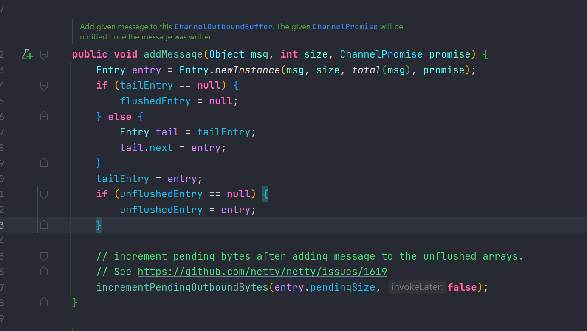


该方法会在用户调用write()发送数据时被调用，它会将待发送的数据加入到数据缓冲区中

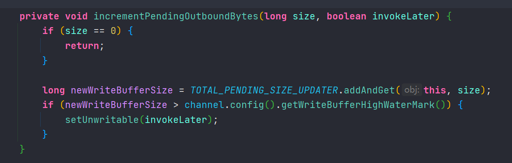


加入缓冲区后，调用incrementPendingOutboundBytes方法增加待发送的字节数，同时判断字节数是否超过高水位

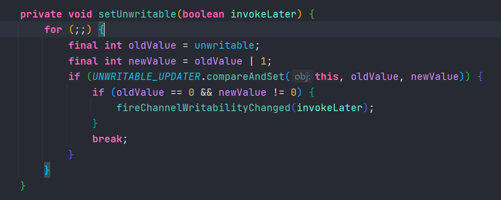


超过高水位则将可写状态设置为false，并触发可写状态改变事件

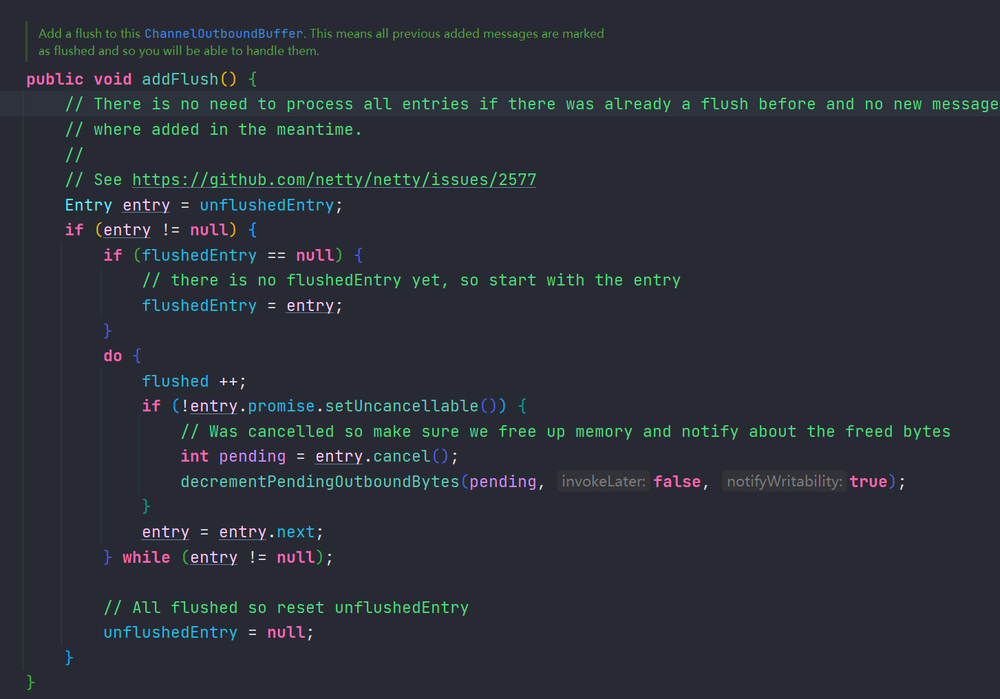


此方法将未刷新的数据刷到准备发送的已刷新队列中


## 高低水位机制的应用


服务端

```java
package mao.t1;

import io.netty.bootstrap.ServerBootstrap;
import io.netty.channel.ChannelHandlerContext;
import io.netty.channel.ChannelInboundHandlerAdapter;
import io.netty.channel.ChannelInitializer;
import io.netty.channel.nio.NioEventLoopGroup;
import io.netty.channel.socket.nio.NioServerSocketChannel;
import io.netty.channel.socket.nio.NioSocketChannel;
import lombok.SneakyThrows;
import lombok.extern.slf4j.Slf4j;

import java.util.concurrent.atomic.AtomicLong;

/**
 * Project name(项目名称)：Netty_traffic_shaping
 * Package(包名): mao.t1
 * Class(类名): Server
 * Author(作者）: mao
 * Author QQ：1296193245
 * GitHub：https://github.com/maomao124/
 * Date(创建日期)： 2023/4/26
 * Time(创建时间)： 20:36
 * Version(版本): 1.0
 * Description(描述)： 高低水位机制-服务端
 */

@Slf4j
public class Server
{
    @SneakyThrows
    public static void main(String[] args)
    {
        new ServerBootstrap()
                .group(new NioEventLoopGroup(), new NioEventLoopGroup())
                .channel(NioServerSocketChannel.class)
                .childHandler(new ChannelInitializer<NioSocketChannel>()
                {
                    @Override
                    protected void initChannel(NioSocketChannel ch) throws Exception
                    {
                        ch.pipeline().addLast(new ChannelInboundHandlerAdapter()
                        {
                            @Override
                            public void channelActive(ChannelHandlerContext ctx) throws Exception
                            {
                                log.info("客户端连接：" + ctx.channel().remoteAddress());
                            }

                            @Override
                            public void channelRead(ChannelHandlerContext ctx, Object msg) throws Exception
                            {
                                log.info("读事件");
                                super.channelRead(ctx, msg);
                            }
                        });
                    }
                })
                .bind(8080)
                .sync();
        log.info("启动完成");
    }
}
```


客户端

```java
package mao.t1;

import io.netty.bootstrap.Bootstrap;
import io.netty.buffer.ByteBuf;
import io.netty.channel.*;
import io.netty.channel.nio.NioEventLoopGroup;
import io.netty.channel.socket.nio.NioSocketChannel;
import lombok.SneakyThrows;
import lombok.extern.slf4j.Slf4j;

import java.net.InetSocketAddress;
import java.nio.charset.StandardCharsets;

/**
 * Project name(项目名称)：Netty_traffic_shaping
 * Package(包名): mao.t1
 * Class(类名): Client
 * Author(作者）: mao
 * Author QQ：1296193245
 * GitHub：https://github.com/maomao124/
 * Date(创建日期)： 2023/4/26
 * Time(创建时间)： 20:36
 * Version(版本): 1.0
 * Description(描述)： 高低水位机制-客户端
 */

@Slf4j
public class Client
{
    @SneakyThrows
    public static void main(String[] args)
    {
        //10kb
        byte[] data = new byte[1024 * 10 * 8];

        Channel channel = new Bootstrap()
                .group(new NioEventLoopGroup())
                .channel(NioSocketChannel.class)
                .handler(new ChannelInitializer<NioSocketChannel>()
                {
                    @Override
                    protected void initChannel(NioSocketChannel ch) throws Exception
                    {
                        ch.pipeline().addLast(new ChannelInboundHandlerAdapter()
                        {
                            @Override
                            public void channelActive(ChannelHandlerContext ctx) throws Exception
                            {
                                //设置低水位
                                ctx.channel().config().setWriteBufferLowWaterMark(20 * 1024);
                                //设置高水位
                                ctx.channel().config().setWriteBufferHighWaterMark(100 * 1024);
                            }

                            @Override
                            public void channelInactive(ChannelHandlerContext ctx) throws Exception
                            {
                                System.exit(1);
                            }
                        });
                    }
                })
                .connect(new InetSocketAddress(8080))
                .sync()
                .channel();

        int total = 0;

        while (true)
        {
            if (channel.isWritable())
            {
                ByteBuf buffer = channel.alloc().buffer(1024 * 10 * 8);
                buffer.writeBytes(data);
                channel.write(buffer);
                total += 10;
                log.info("写入10kb数据，已发送：" + total + "kb");
            }
            else
            {
                log.info("服务端不可写");
                channel.flush();
                Thread.sleep(1000);
            }

        }
    }
}
```


客户端输出：

```sh
2023-04-26  21:39:43.110  [main] INFO  mao.t1.Client:  写入10kb数据，已发送：10kb
2023-04-26  21:39:43.111  [main] INFO  mao.t1.Client:  写入10kb数据，已发送：20kb
2023-04-26  21:39:43.111  [main] INFO  mao.t1.Client:  服务端不可写
2023-04-26  21:39:44.116  [main] INFO  mao.t1.Client:  写入10kb数据，已发送：30kb
2023-04-26  21:39:44.116  [main] INFO  mao.t1.Client:  写入10kb数据，已发送：40kb
2023-04-26  21:39:44.116  [main] INFO  mao.t1.Client:  服务端不可写
2023-04-26  21:39:45.127  [main] INFO  mao.t1.Client:  写入10kb数据，已发送：50kb
2023-04-26  21:39:45.128  [main] INFO  mao.t1.Client:  写入10kb数据，已发送：60kb
2023-04-26  21:39:45.128  [main] INFO  mao.t1.Client:  服务端不可写
2023-04-26  21:39:46.141  [main] INFO  mao.t1.Client:  写入10kb数据，已发送：70kb
2023-04-26  21:39:46.141  [main] INFO  mao.t1.Client:  写入10kb数据，已发送：80kb
2023-04-26  21:39:46.141  [main] INFO  mao.t1.Client:  服务端不可写
2023-04-26  21:39:47.145  [main] INFO  mao.t1.Client:  写入10kb数据，已发送：90kb
2023-04-26  21:39:47.145  [main] INFO  mao.t1.Client:  写入10kb数据，已发送：100kb
2023-04-26  21:39:47.145  [main] INFO  mao.t1.Client:  服务端不可写
```


**通过ChannelHandlerContext即可设置高低水位，在激活事件中设置可以使配置在建立连接时就生效，高低水位如果设置在客户端就是控制发送给服务器的数据速度，设置在服务器就是控制发送给客户端的数据速度**


虽然Netty提供了这个一个高低水位的机制,控制向Netty缓冲区写入数据.但是我们可以忽略它,依然可以向Netty缓冲区写入数据,但是遗憾的是,**TCP缓冲区大小是固定的**,总会达到某个时间点,Netty不能向TCP缓冲区写入数据了


## 模拟限速下载

服务端

```java
package mao.t2;

import io.netty.bootstrap.ServerBootstrap;
import io.netty.buffer.ByteBuf;
import io.netty.channel.ChannelHandlerContext;
import io.netty.channel.ChannelInboundHandlerAdapter;
import io.netty.channel.ChannelInitializer;
import io.netty.channel.nio.NioEventLoopGroup;
import io.netty.channel.socket.nio.NioServerSocketChannel;
import io.netty.channel.socket.nio.NioSocketChannel;
import lombok.SneakyThrows;
import lombok.extern.slf4j.Slf4j;

/**
 * Project name(项目名称)：Netty_traffic_shaping
 * Package(包名): mao.t2
 * Class(类名): Server
 * Author(作者）: mao
 * Author QQ：1296193245
 * GitHub：https://github.com/maomao124/
 * Date(创建日期)： 2023/4/26
 * Time(创建时间)： 21:45
 * Version(版本): 1.0
 * Description(描述)： 高低水位机制-模拟限速下载-服务端
 */

@Slf4j
public class Server
{
    @SneakyThrows
    public static void main(String[] args)
    {
        new ServerBootstrap()
                .group(new NioEventLoopGroup(), new NioEventLoopGroup())
                .channel(NioServerSocketChannel.class)
                .childHandler(new ChannelInitializer<NioSocketChannel>()
                {
                    @Override
                    protected void initChannel(NioSocketChannel ch) throws Exception
                    {
                        ch.pipeline().addLast(new ChannelInboundHandlerAdapter()
                        {

                            @Override
                            public void channelActive(ChannelHandlerContext ctx) throws Exception
                            {
                                //设置低水位
                                ctx.channel().config().setWriteBufferLowWaterMark(10 * 1024);
                                //设置高水位
                                ctx.channel().config().setWriteBufferHighWaterMark(20 * 1024);
                                log.info("客户端连接：" + ctx.channel().remoteAddress());
                                while (true)
                                {

                                    if (ctx.channel().isWritable())
                                    {
                                        //一次100字节
                                        ByteBuf buffer = ctx.alloc().buffer(100 * 8);
                                        buffer.writeBytes(new byte[100 * 8]);
                                        ctx.write(buffer);
                                    }
                                    else
                                    {
                                        ctx.channel().flush();
                                        Thread.sleep(1000);
                                    }
                                }
                            }

                            @Override
                            public void channelRead(ChannelHandlerContext ctx, Object msg) throws Exception
                            {
                                log.info("读事件");
                                super.channelRead(ctx, msg);
                            }
                        });
                    }
                })
                .bind(8080)
                .sync();
        log.info("启动完成");
    }
}
```


客户端

```java
package mao.t2;

import io.netty.bootstrap.Bootstrap;
import io.netty.buffer.ByteBuf;
import io.netty.channel.Channel;
import io.netty.channel.ChannelHandlerContext;
import io.netty.channel.ChannelInboundHandlerAdapter;
import io.netty.channel.ChannelInitializer;
import io.netty.channel.nio.NioEventLoopGroup;
import io.netty.channel.socket.nio.NioSocketChannel;
import lombok.SneakyThrows;
import lombok.extern.slf4j.Slf4j;

import java.net.InetSocketAddress;
import java.util.concurrent.atomic.AtomicLong;

/**
 * Project name(项目名称)：Netty_traffic_shaping
 * Package(包名): mao.t2
 * Class(类名): Client
 * Author(作者）: mao
 * Author QQ：1296193245
 * GitHub：https://github.com/maomao124/
 * Date(创建日期)： 2023/4/26
 * Time(创建时间)： 21:45
 * Version(版本): 1.0
 * Description(描述)： 高低水位机制-模拟限速下载-客户端
 */

@Slf4j
public class Client
{
    @SneakyThrows
    public static void main(String[] args)
    {
        AtomicLong total = new AtomicLong();
        Channel channel = new Bootstrap()
                .group(new NioEventLoopGroup())
                .channel(NioSocketChannel.class)
                .handler(new ChannelInitializer<NioSocketChannel>()
                {
                    @Override
                    protected void initChannel(NioSocketChannel ch) throws Exception
                    {
                        ch.pipeline().addLast(new ChannelInboundHandlerAdapter()
                        {
                            @Override
                            public void channelRead(ChannelHandlerContext ctx, Object msg) throws Exception
                            {
                                ByteBuf byteBuf = (ByteBuf) msg;
                                int writerIndex = byteBuf.writerIndex();
                                long l = total.addAndGet(writerIndex);
                                log.info("已下载：" + l / 8 / 1024 + "字节");
                                super.channelRead(ctx, msg);
                            }
                        });
                    }
                })
                .connect(new InetSocketAddress(8080))
                .sync()
                .channel();

    }
}
```


```sh
2023-04-26  22:05:23.391  [nioEventLoopGroup-2-1] INFO  mao.t2.Client:  已下载：0字节
2023-04-26  22:05:23.392  [nioEventLoopGroup-2-1] INFO  mao.t2.Client:  已下载：2字节
2023-04-26  22:05:23.393  [nioEventLoopGroup-2-1] INFO  mao.t2.Client:  已下载：7字节
2023-04-26  22:05:24.396  [nioEventLoopGroup-2-1] INFO  mao.t2.Client:  已下载：8字节
2023-04-26  22:05:24.396  [nioEventLoopGroup-2-1] INFO  mao.t2.Client:  已下载：13字节
2023-04-26  22:05:24.396  [nioEventLoopGroup-2-1] INFO  mao.t2.Client:  已下载：14字节
2023-04-26  22:05:25.411  [nioEventLoopGroup-2-1] INFO  mao.t2.Client:  已下载：17字节
2023-04-26  22:05:25.412  [nioEventLoopGroup-2-1] INFO  mao.t2.Client:  已下载：21字节
2023-04-26  22:05:25.412  [nioEventLoopGroup-2-1] INFO  mao.t2.Client:  已下载：21字节
2023-04-26  22:05:26.427  [nioEventLoopGroup-2-1] INFO  mao.t2.Client:  已下载：23字节
2023-04-26  22:05:26.427  [nioEventLoopGroup-2-1] INFO  mao.t2.Client:  已下载：24字节
2023-04-26  22:05:26.427  [nioEventLoopGroup-2-1] INFO  mao.t2.Client:  已下载：26字节
2023-04-26  22:05:26.427  [nioEventLoopGroup-2-1] INFO  mao.t2.Client:  已下载：28字节
2023-04-26  22:05:27.430  [nioEventLoopGroup-2-1] INFO  mao.t2.Client:  已下载：30字节
2023-04-26  22:05:27.431  [nioEventLoopGroup-2-1] INFO  mao.t2.Client:  已下载：34字节
2023-04-26  22:05:27.431  [nioEventLoopGroup-2-1] INFO  mao.t2.Client:  已下载：36字节
......
```


## 流量整形的实现

 netty可以用于流量整形的处理器有ChannelTrafficShapingHandler、GlobalTrafficShapingHandler、GlobalChannelTrafficShapingHandler，这三个处理器都继承了AbstractTrafficShapingHandler，AbstractTrafficShapingHandler主要实现了控制读取速度、判断发送数据需要的时间、统计周期内读写的字节。

* GlobalTrafficShapingHandler：全局流量整形，放在服务器端，表示所有链接该服务器的channel整体的流量不超过阈值
* ChannelTrafficShapingHandler：表示单个channel的流量作出限制


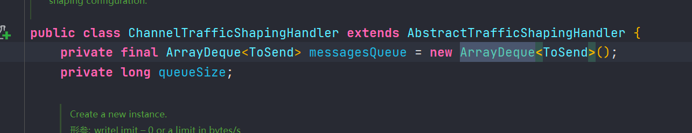


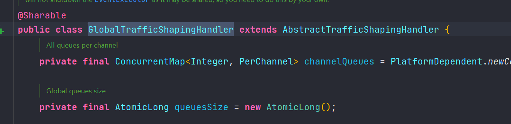


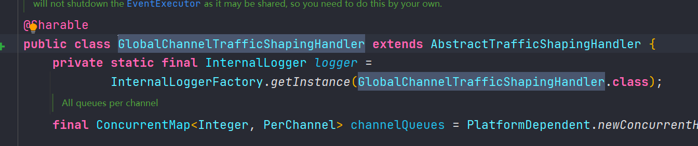


AbstractTrafficShapingHandler部分源码


### channelRead方法

```java
public void channelRead(ChannelHandlerContext ctx, Object msg) throws Exception {
  		//计算读取到的消息大小
        long size = this.calculateSize(msg);
        //获取当前时间
        long now = TrafficCounter.milliSecondFromNano();
        if(size > 0L) {
    		//根据读取速率计算已读取数据需要暂停多长时间
            long wait = this.trafficCounter.readTimeToWait(size, this.readLimit, this.maxTime, now);
            //此处直接返回wait参数的值，可以重写该方法控制暂停读取的时间
            wait = this.checkWaitReadTime(ctx, wait, now);
            //如果暂停时间小于10毫秒，则不暂停读取，允许读取速率存在一定的偏差
            if(wait >= 10L) {
                Channel channel = ctx.channel();
                ChannelConfig config = channel.config();
                if(logger.isDebugEnabled()) {
                    logger.debug("Read suspend: " + wait + ':' + config.isAutoRead() + ':' + isHandlerActive(ctx));
                }
				//如果自动读取被关闭且是该处理器暂停的
                if(config.isAutoRead() && isHandlerActive(ctx)) {
                    //关闭自动读取
                    config.setAutoRead(false);
                    //在channel中设置属性，标记读取事件被处理器暂停了
                    channel.attr(READ_SUSPENDED).set(Boolean.valueOf(true));
                    //从channel属性中获取重启读取任务
                    Attribute<Runnable> attr = channel.attr(REOPEN_TASK);
                    Runnable reopenTask = (Runnable)attr.get();
                    if(reopenTask == null) {
                        reopenTask = new AbstractTrafficShapingHandler.ReopenReadTimerTask(ctx);
                        attr.set(reopenTask);
                    }
					//将读取事件加入到netty的线程池中作为一个定时任务
                    ctx.executor().schedule((Runnable)reopenTask, wait, TimeUnit.MILLISECONDS);
                    if(logger.isDebugEnabled()) {
                        logger.debug("Suspend final status => " + config.isAutoRead() + ':' + isHandlerActive(ctx) + " will reopened at: " + wait);
                    }
                }
            }
        }
 
        this.informReadOperation(ctx, now);
        //继续向下传播读取事件
        ctx.fireChannelRead(msg);
    }
```


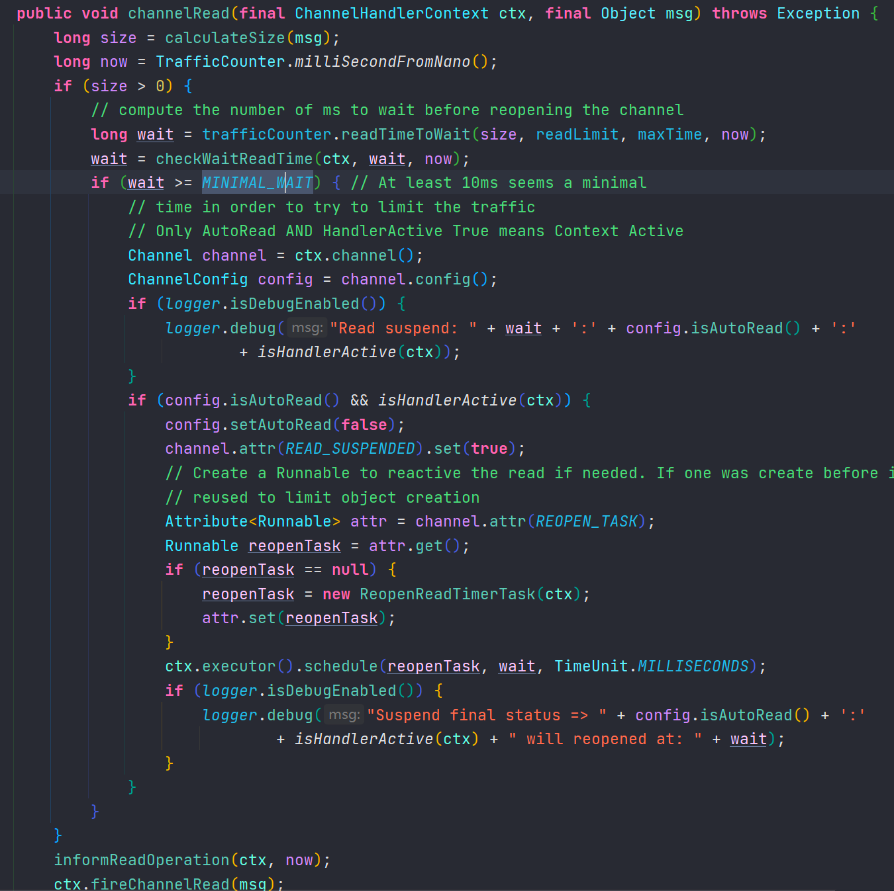


### ReopenReadTimerTask类

```java
/**
 * Class to implement setReadable at fix time
 */
static final class ReopenReadTimerTask implements Runnable {
    final ChannelHandlerContext ctx;
    ReopenReadTimerTask(ChannelHandlerContext ctx) {
        this.ctx = ctx;
    }

    @Override
    public void run() {
        Channel channel = ctx.channel();
        ChannelConfig config = channel.config();
        if (!config.isAutoRead() && isHandlerActive(ctx)) {
            // If AutoRead is False and Active is True, user make a direct setAutoRead(false)
            // Then Just reset the status
            if (logger.isDebugEnabled()) {
                logger.debug("Not unsuspend: " + config.isAutoRead() + ':' +
                        isHandlerActive(ctx));
            }
            channel.attr(READ_SUSPENDED).set(false);
        } else {
            // Anything else allows the handler to reset the AutoRead
            if (logger.isDebugEnabled()) {
                if (config.isAutoRead() && !isHandlerActive(ctx)) {
                    if (logger.isDebugEnabled()) {
                        logger.debug("Unsuspend: " + config.isAutoRead() + ':' +
                                isHandlerActive(ctx));
                    }
                } else {
                    if (logger.isDebugEnabled()) {
                        logger.debug("Normal unsuspend: " + config.isAutoRead() + ':'
                                + isHandlerActive(ctx));
                    }
                }
            }
            channel.attr(READ_SUSPENDED).set(false);
            config.setAutoRead(true);
            channel.read();
        }
        if (logger.isDebugEnabled()) {
            logger.debug("Unsuspend final status => " + config.isAutoRead() + ':'
                    + isHandlerActive(ctx));
        }
    }
}
```


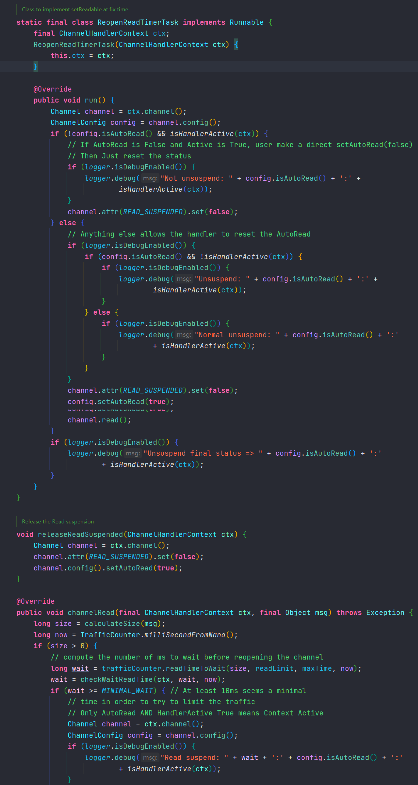


### write方法

```java
   public void write(ChannelHandlerContext ctx, Object msg, ChannelPromise promise) throws Exception {
   		//计算当前接收到的数据大小
        long size = this.calculateSize(msg);
        //获取当前时间
        long now = TrafficCounter.milliSecondFromNano();
        if(size > 0L) {
        //计算要发送的数据以写速率需要发送多久
            long wait = this.trafficCounter.writeTimeToWait(size, this.writeLimit, this.maxTime, now);
            //如果等待时间小于10毫秒就可以不用等待，允许速率存在一定的偏差
            if(wait >= 10L) {
                if(logger.isDebugEnabled()) {
                    logger.debug("Write suspend: " + wait + ':' + ctx.channel().config().isAutoRead() + ':' + isHandlerActive(ctx));
                }
		//将写数据的功能留给子类实现
                this.submitWrite(ctx, msg, size, wait, now, promise);
                return;
            }
        }
		
        this.submitWrite(ctx, msg, size, 0L, now, promise);
       
   }
```


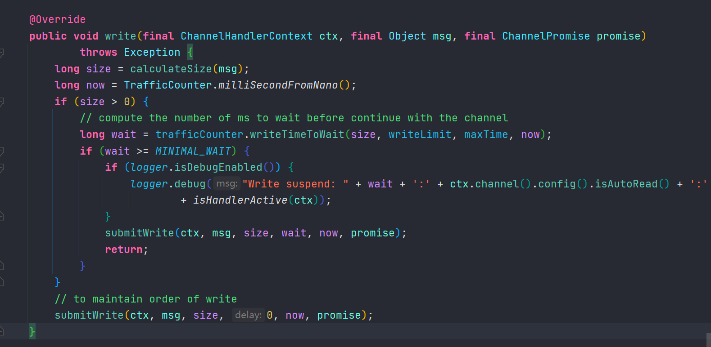


### ChannelTrafficShapingHandler的submitWrite方法

```java
void submitWrite(final ChannelHandlerContext ctx, Object msg, long size, long delay, long now, ChannelPromise promise) {
    	//内部类，用于存储待发送的数据
        ChannelTrafficShapingHandler.ToSend newToSend;
        synchronized(this) {
        	//如果不需要延迟发送且待发送消息队列为空
            if(delay == 0L && this.messagesQueue.isEmpty()) {
            	//统计发送的字节
                this.trafficCounter.bytesRealWriteFlowControl(size);
                //发送数据给客户端
                ctx.write(msg, promise);
                return;
            }
			//封装待发送的数据
            newToSend = new ChannelTrafficShapingHandler.ToSend(delay + now, msg, promise, null);
            //将待发送的任务加入消息队列
            this.messagesQueue.addLast(newToSend);
            this.queueSize += size;
            //检查待发送的消息队列大小是否超过了最大发送数据限制或延迟时间超过最大等待时间，超过则设置写状态为false，并触发写状态改变事件
            this.checkWriteSuspend(ctx, delay, this.queueSize);
        }
 
        final long futureNow = newToSend.relativeTimeAction;
        //将发送数据任务加入定时任务
        ctx.executor().schedule(new Runnable() {
            public void run() {
                ChannelTrafficShapingHandler.this.sendAllValid(ctx, futureNow);
            }
        }, delay, TimeUnit.MILLISECONDS);
    }
    
    private void sendAllValid(ChannelHandlerContext ctx, long now) {
    //由于是线程池可能存在多个定时任务同时执行，因此要加入同步锁
        synchronized(this) {
        //获取待发送消息队列的第一个元素
            ChannelTrafficShapingHandler.ToSend newToSend = (ChannelTrafficShapingHandler.ToSend)this.messagesQueue.pollFirst();
 
            while(true) {
                if(newToSend != null) {
                //如果任务的执行时间小于当前时间
                    if(newToSend.relativeTimeAction <= now) {
                    	//计算数据大小
                        long size = this.calculateSize(newToSend.toSend);
                        //统计发送的字节数
                        this.trafficCounter.bytesRealWriteFlowControl(size);
                        //减少消息队列的数据大小
                        this.queueSize -= size;
                        //发送数据给客户端
                        ctx.write(newToSend.toSend, newToSend.promise);
                        //继续获取队列中第一个发送任务
                        newToSend = (ChannelTrafficShapingHandler.ToSend)this.messagesQueue.pollFirst();
                        continue;
                    }
					//任务还不能执行，将发送任务重新加入到队列的队首
                    this.messagesQueue.addFirst(newToSend);
                }
 
                if(this.messagesQueue.isEmpty()) {
               		//将可写状态设置为true
                    this.releaseWriteSuspended(ctx);
                }
                break;
            }
        }
		//刷新缓冲区，真正将数据发送给客户端
        ctx.flush();
    }
```


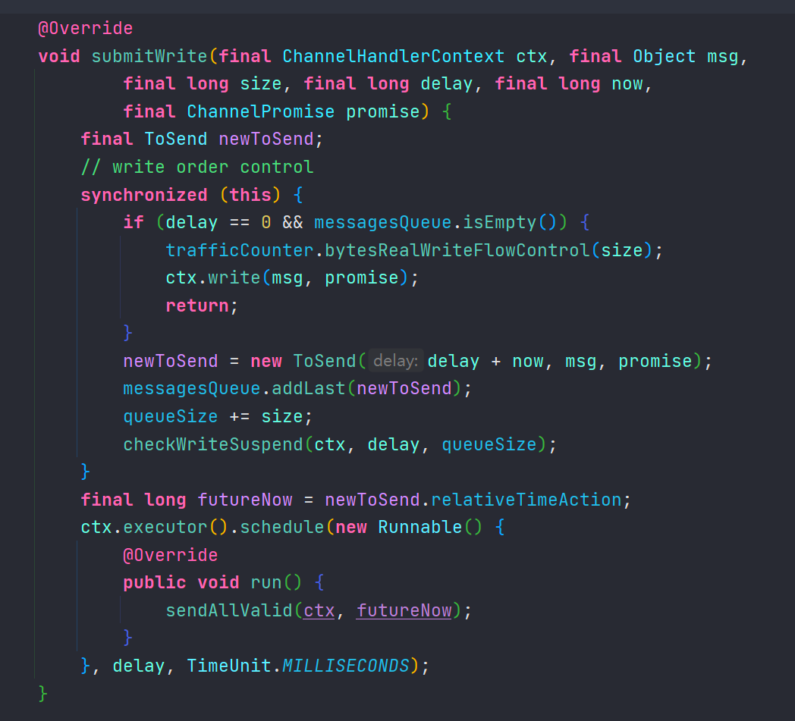


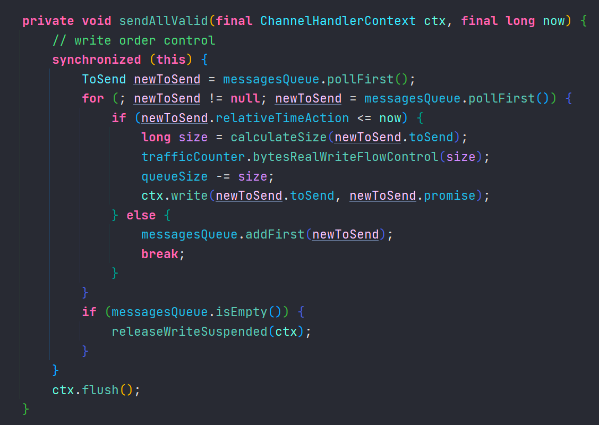


netty使用了TrafficCounter来计算读取和发送的等待时间以及监控读取发送的字节数


### TrafficCounter

```java
public synchronized void start() {
    	//该监控器是否被启动了
        if(!this.monitorActive) {
        	//记录本次启动监控器时间
            this.lastTime.set(milliSecondFromNano());
            //获取监控周期
            long localCheckInterval = this.checkInterval.get();
            //如果周期大于0且定时任务执行器不为空
            if(localCheckInterval > 0L && this.executor != null) {
            	//设置监控状态
                this.monitorActive = true;
                //获取监控任务
                this.monitor = new TrafficCounter.TrafficMonitoringTask();
                //将监控任务加入定时任务中
                this.scheduledFuture = this.executor.schedule(this.monitor, localCheckInterval, TimeUnit.MILLISECONDS);
            }
 
        }
    }
    
    public synchronized void stop() {
        if(this.monitorActive) {
            this.monitorActive = false;
            //重置监控信息
            this.resetAccounting(milliSecondFromNano());
            if(this.trafficShapingHandler != null) {
                this.trafficShapingHandler.doAccounting(this);
            }
 
            if(this.scheduledFuture != null) {
            	//取消定时任务
                this.scheduledFuture.cancel(true);
            }
 
        }
    }
 
    void long recv) {
    	//累加当前周期内读取的字节数
        this.currentReadBytes.addAndGet(recv);
        //累加当前监控器记录的已读取字节数
        this.cumulativeReadBytes.addAndGet(recv);
    }
 
    void bytesWriteFlowControl(long write) {
    	//累加当前周期内读取的字节数
        this.currentWrittenBytes.addAndGet(write);
        //累加当前监控器记录的已读取字节数
        this.cumulativeWrittenBytes.addAndGet(write);
    }
    
    	//该方法的作业时重置监控器状态，将本次周期内记录的数据转到上次
        synchronized void resetAccounting(long newLastTime) {
        //计算上次启动或重置监控器到本次重置监控器的时间
        long interval = newLastTime - this.lastTime.getAndSet(newLastTime);
        if(interval != 0L) {
            if(logger.isDebugEnabled() && interval > this.checkInterval() << 1) {
                logger.debug("Acct schedule not ok: " + interval + " > 2*" + this.checkInterval() + " from " + this.name);
            }
			//将本次监控周期内读取的字节数转到上次
            this.lastReadBytes = this.currentReadBytes.getAndSet(0L);
            //将本次监控周期内发送的字节数转到上次
            this.lastWrittenBytes = this.currentWrittenBytes.getAndSet(0L);
            this.lastReadThroughput = this.lastReadBytes * 1000L / interval;
            this.lastWriteThroughput = this.lastWrittenBytes * 1000L / interval;
            this.realWriteThroughput = this.realWrittenBytes.getAndSet(0L) * 1000L / interval;
            this.lastWritingTime = Math.max(this.lastWritingTime, this.writingTime);
            this.lastReadingTime = Math.max(this.lastReadingTime, this.readingTime);
        }
    }
    
    private final class TrafficMonitoringTask implements Runnable {
        private TrafficMonitoringTask() {
        }
 
        public void run() {
            if(TrafficCounter.this.monitorActive) {
            //重置监控器状态，转移监控信息到上次
                TrafficCounter.this.resetAccounting(TrafficCounter.milliSecondFromNano());
                if(TrafficCounter.this.trafficShapingHandler != null) {
                //调用监控方法，用户可以重写该方法，以在监控重置时进行某些操作
                    TrafficCounter.this.trafficShapingHandler.doAccounting(TrafficCounter.this);
                }
				//重新将该监控任务加入定时任务中
                TrafficCounter.this.scheduledFuture = TrafficCounter.this.executor.schedule(this, TrafficCounter.this.checkInterval.get(), TimeUnit.MILLISECONDS);
            }
        }
    }
```


从上面的TrafficCounter的源码中，我们可以看出TrafficCounter的周期性统计也是通过定时任务来完成的，当AbstractTrafficShapingHandler读写数据时就会调用bytesWriteFlowControl和bytesRecvFlowControl方法记录读写的数据大小，而TrafficCounter每次执行任务时就会将当前周期记录的读写字节数，转移到上次状态中。在监控过程中，TrafficCounter会调用AbstractTrafficShapingHandler的doAccounting方法，该方法的实现是空的，什么也不做，我们想做些什么可以继承该类来重写doAccounting方法


### 结论

**netty的限流并非真正的控制每秒读取写出的字节数，而是先读取一部分字节(读取的这部分字节大小，可以通过设置netty的接收缓冲区控制，但是不建议更改，因为netty会根据读取的字节调整合适的大小，以减少内存开销)，然后根据当前的读取速率限制计算出下一次读取需要等待多久。写出速率也是根据当前写出速率计算出发送时间，然后将发送数据封装到一个待发送任务队列中，再启动定时任务监听该消息队列将数据发送出去。虽然netty是通过暂停读取和发送来实现的，但平均来看还是实现了流量控制的目的**


## 流量整形的应用

服务端

```java
package mao.t3;

import io.netty.bootstrap.ServerBootstrap;
import io.netty.buffer.ByteBuf;
import io.netty.buffer.Unpooled;
import io.netty.channel.ChannelHandlerContext;
import io.netty.channel.ChannelInboundHandlerAdapter;
import io.netty.channel.ChannelInitializer;
import io.netty.channel.nio.NioEventLoopGroup;
import io.netty.channel.socket.nio.NioServerSocketChannel;
import io.netty.channel.socket.nio.NioSocketChannel;
import lombok.SneakyThrows;
import lombok.extern.slf4j.Slf4j;


/**
 * Project name(项目名称)：Netty_traffic_shaping
 * Package(包名): mao.t3
 * Class(类名): Server
 * Author(作者）: mao
 * Author QQ：1296193245
 * GitHub：https://github.com/maomao124/
 * Date(创建日期)： 2023/4/26
 * Time(创建时间)： 22:28
 * Version(版本): 1.0
 * Description(描述)： 流量整形-ChannelTrafficShapingHandler-服务端
 */

@Slf4j
public class Server
{
    @SneakyThrows
    public static void main(String[] args)
    {
        new ServerBootstrap()
                .group(new NioEventLoopGroup(), new NioEventLoopGroup())
                .channel(NioServerSocketChannel.class)
                .childHandler(new ChannelInitializer<NioSocketChannel>()
                {
                    @Override
                    protected void initChannel(NioSocketChannel ch) throws Exception
                    {
                        //平均每秒发送20k个字节，平均每秒读取10k个字节，TrafficCounter每秒统计一次，最大读写等待时间为1秒
                        ch.pipeline().addLast(new ServerChannelTrafficShapingHandler(20 * 1024, 10 * 1024,
                                        1000L, 1000L))
                                .addLast(new ChannelInboundHandlerAdapter()
                                {
                                    @Override
                                    public void channelRead(ChannelHandlerContext ctx, Object msg) throws Exception
                                    {
                                        super.channelRead(ctx, msg);
                                    }
                                });
                    }
                })
                .bind(8080)
                .sync();
        log.info("启动完成");
    }
}
```


ServerChannelTrafficShapingHandler

```java
package mao.t3;

import io.netty.handler.traffic.ChannelTrafficShapingHandler;
import io.netty.handler.traffic.TrafficCounter;
import lombok.extern.slf4j.Slf4j;

/**
 * Project name(项目名称)：Netty_traffic_shaping
 * Package(包名): mao.t3
 * Class(类名): ServerChannelTrafficShapingHandler
 * Author(作者）: mao
 * Author QQ：1296193245
 * GitHub：https://github.com/maomao124/
 * Date(创建日期)： 2023/4/26
 * Time(创建时间)： 22:44
 * Version(版本): 1.0
 * Description(描述)： 无
 */

@Slf4j
public class ServerChannelTrafficShapingHandler extends ChannelTrafficShapingHandler
{
    /**
     * 服务器通道流量整形处理程序
     *
     * @param writeLimit    写限制
     * @param readLimit     阅读限制
     * @param checkInterval 检查间隔
     * @param maxTime       最大值时间
     */
    public ServerChannelTrafficShapingHandler(long writeLimit, long readLimit, long checkInterval, long maxTime)
    {
        super(writeLimit, readLimit, checkInterval, maxTime);
    }

    @Override
    protected void doAccounting(TrafficCounter counter)
    {
        log.info("上个监控周期读取了" + counter.lastReadBytes() + "个字节,发送了" + counter.lastWrittenBytes() + "个字节");
    }
}
```


客户端

```java
package mao.t3;

import io.netty.bootstrap.Bootstrap;
import io.netty.buffer.ByteBuf;
import io.netty.buffer.Unpooled;
import io.netty.channel.Channel;
import io.netty.channel.ChannelHandlerContext;
import io.netty.channel.ChannelInboundHandlerAdapter;
import io.netty.channel.ChannelInitializer;
import io.netty.channel.nio.NioEventLoopGroup;
import io.netty.channel.socket.nio.NioSocketChannel;
import io.netty.handler.codec.string.StringDecoder;
import lombok.SneakyThrows;
import lombok.extern.slf4j.Slf4j;

import java.net.InetSocketAddress;
import java.util.concurrent.Executors;
import java.util.concurrent.ScheduledExecutorService;
import java.util.concurrent.TimeUnit;
import java.util.concurrent.atomic.AtomicInteger;

/**
 * Project name(项目名称)：Netty_traffic_shaping
 * Package(包名): mao.t3
 * Class(类名): Client
 * Author(作者）: mao
 * Author QQ：1296193245
 * GitHub：https://github.com/maomao124/
 * Date(创建日期)： 2023/4/26
 * Time(创建时间)： 22:29
 * Version(版本): 1.0
 * Description(描述)： 流量整形-ChannelTrafficShapingHandler-客户端，每秒发送3M的数据
 */

@Slf4j
public class Client
{
    @SneakyThrows
    public static void main(String[] args)
    {
        Channel channel = new Bootstrap()
                .group(new NioEventLoopGroup())
                .channel(NioSocketChannel.class)
                .handler(new ChannelInitializer<NioSocketChannel>()
                {
                    @Override
                    protected void initChannel(NioSocketChannel ch) throws Exception
                    {
                        ch.pipeline().addLast(new StringDecoder());
                        ch.pipeline().addLast(new ChannelInboundHandlerAdapter()
                        {
                            private AtomicInteger SEQ = new AtomicInteger(0);

                            final byte[] ECHO_REQ = new byte[1024 * 1024];

                            ScheduledExecutorService scheduledExecutorService =
                                    Executors.newScheduledThreadPool(1);

                            @Override
                            public void channelActive(ChannelHandlerContext ctx)
                            {
                                scheduledExecutorService.scheduleAtFixedRate(() ->
                                {
                                    ByteBuf buf = null;
                                    for (int i = 0; i < 3; i++)
                                    {
                                        buf = Unpooled.copiedBuffer(ECHO_REQ);
                                        if (ctx.channel().isWritable())
                                        {
                                            SEQ.getAndAdd(buf.readableBytes());
                                            ctx.write(buf);
                                        }
                                    }
                                    ctx.flush();
                                    int counter = SEQ.getAndSet(0);
                                    log.info("写入速度 : " + (double) counter / (1024 * 1024) + " M/s");
                                }, 0, 1000, TimeUnit.MILLISECONDS);
                            }

                            @Override
                            public void exceptionCaught(ChannelHandlerContext ctx, Throwable cause)
                            {
                                cause.printStackTrace();
                                ctx.close();
                            }
                        });
                    }
                })
                .connect(new InetSocketAddress(8080))
                .sync()
                .channel();
    }
}
```


服务端日志

```sh
2023-04-26  23:03:15.030  [main] INFO  mao.t3.Server:  启动完成
2023-04-26  23:03:19.261  [nioEventLoopGroup-3-1] INFO  mao.t3.ServerChannelTrafficShapingHandler:  上个监控周期读取了0个字节,发送了0个字节
2023-04-26  23:03:20.274  [nioEventLoopGroup-3-1] INFO  mao.t3.ServerChannelTrafficShapingHandler:  上个监控周期读取了17408个字节,发送了0个字节
2023-04-26  23:03:21.268  [nioEventLoopGroup-3-1] INFO  mao.t3.ServerChannelTrafficShapingHandler:  上个监控周期读取了65536个字节,发送了0个字节
2023-04-26  23:03:22.271  [nioEventLoopGroup-3-1] INFO  mao.t3.ServerChannelTrafficShapingHandler:  上个监控周期读取了65536个字节,发送了0个字节
2023-04-26  23:03:23.269  [nioEventLoopGroup-3-1] INFO  mao.t3.ServerChannelTrafficShapingHandler:  上个监控周期读取了65536个字节,发送了0个字节
2023-04-26  23:03:24.270  [nioEventLoopGroup-3-1] INFO  mao.t3.ServerChannelTrafficShapingHandler:  上个监控周期读取了65536个字节,发送了0个字节
2023-04-26  23:03:25.267  [nioEventLoopGroup-3-1] INFO  mao.t3.ServerChannelTrafficShapingHandler:  上个监控周期读取了65536个字节,发送了0个字节
2023-04-26  23:03:26.262  [nioEventLoopGroup-3-1] INFO  mao.t3.ServerChannelTrafficShapingHandler:  上个监控周期读取了65536个字节,发送了0个字节
2023-04-26  23:03:27.273  [nioEventLoopGroup-3-1] INFO  mao.t3.ServerChannelTrafficShapingHandler:  上个监控周期读取了65536个字节,发送了0个字节
2023-04-26  23:03:28.275  [nioEventLoopGroup-3-1] INFO  mao.t3.ServerChannelTrafficShapingHandler:  上个监控周期读取了65536个字节,发送了0个字节
2023-04-26  23:03:29.266  [nioEventLoopGroup-3-1] INFO  mao.t3.ServerChannelTrafficShapingHandler:  上个监控周期读取了65536个字节,发送了0个字节
2023-04-26  23:03:30.274  [nioEventLoopGroup-3-1] INFO  mao.t3.ServerChannelTrafficShapingHandler:  上个监控周期读取了65536个字节,发送了0个字节
2023-04-26  23:03:31.267  [nioEventLoopGroup-3-1] INFO  mao.t3.ServerChannelTrafficShapingHandler:  上个监控周期读取了65536个字节,发送了0个字节
2023-04-26  23:03:32.270  [nioEventLoopGroup-3-1] INFO  mao.t3.ServerChannelTrafficShapingHandler:  上个监控周期读取了65536个字节,发送了0个字节
2023-04-26  23:03:33.269  [nioEventLoopGroup-3-1] INFO  mao.t3.ServerChannelTrafficShapingHandler:  上个监控周期读取了65536个字节,发送了0个字节
2023-04-26  23:03:34.267  [nioEventLoopGroup-3-1] INFO  mao.t3.ServerChannelTrafficShapingHandler:  上个监控周期读取了65536个字节,发送了0个字节
2023-04-26  23:03:35.275  [nioEventLoopGroup-3-1] INFO  mao.t3.ServerChannelTrafficShapingHandler:  上个监控周期读取了65536个字节,发送了0个字节
2023-04-26  23:03:36.266  [nioEventLoopGroup-3-1] INFO  mao.t3.ServerChannelTrafficShapingHandler:  上个监控周期读取了65536个字节,发送了0个字节
2023-04-26  23:03:37.268  [nioEventLoopGroup-3-1] INFO  mao.t3.ServerChannelTrafficShapingHandler:  上个监控周期读取了65536个字节,发送了0个字节
2023-04-26  23:03:38.272  [nioEventLoopGroup-3-1] INFO  mao.t3.ServerChannelTrafficShapingHandler:  上个监控周期读取了65536个字节,发送了0个字节
2023-04-26  23:03:39.267  [nioEventLoopGroup-3-1] INFO  mao.t3.ServerChannelTrafficShapingHandler:  上个监控周期读取了65536个字节,发送了0个字节
2023-04-26  23:03:40.275  [nioEventLoopGroup-3-1] INFO  mao.t3.ServerChannelTrafficShapingHandler:  上个监控周期读取了65536个字节,发送了0个字节
2023-04-26  23:03:41.267  [nioEventLoopGroup-3-1] INFO  mao.t3.ServerChannelTrafficShapingHandler:  上个监控周期读取了65536个字节,发送了0个字节
2023-04-26  23:03:42.264  [nioEventLoopGroup-3-1] INFO  mao.t3.ServerChannelTrafficShapingHandler:  上个监控周期读取了65536个字节,发送了0个字节
2023-04-26  23:03:43.267  [nioEventLoopGroup-3-1] INFO  mao.t3.ServerChannelTrafficShapingHandler:  上个监控周期读取了65536个字节,发送了0个字节
2023-04-26  23:03:44.266  [nioEventLoopGroup-3-1] INFO  mao.t3.ServerChannelTrafficShapingHandler:  上个监控周期读取了65536个字节,发送了0个字节
2023-04-26  23:03:45.273  [nioEventLoopGroup-3-1] INFO  mao.t3.ServerChannelTrafficShapingHandler:  上个监控周期读取了65536个字节,发送了0个字节
2023-04-26  23:03:46.276  [nioEventLoopGroup-3-1] INFO  mao.t3.ServerChannelTrafficShapingHandler:  上个监控周期读取了65536个字节,发送了0个字节
2023-04-26  23:03:47.270  [nioEventLoopGroup-3-1] INFO  mao.t3.ServerChannelTrafficShapingHandler:  上个监控周期读取了65536个字节,发送了0个字节
2023-04-26  23:03:48.273  [nioEventLoopGroup-3-1] INFO  mao.t3.ServerChannelTrafficShapingHandler:  上个监控周期读取了65536个字节,发送了0个字节
2023-04-26  23:03:49.265  [nioEventLoopGroup-3-1] INFO  mao.t3.ServerChannelTrafficShapingHandler:  上个监控周期读取了65536个字节,发送了0个字节
2023-04-26  23:03:50.274  [nioEventLoopGroup-3-1] INFO  mao.t3.ServerChannelTrafficShapingHandler:  上个监控周期读取了65536个字节,发送了0个字节
2023-04-26  23:03:51.272  [nioEventLoopGroup-3-1] INFO  mao.t3.ServerChannelTrafficShapingHandler:  上个监控周期读取了65536个字节,发送了0个字节
2023-04-26  23:03:52.274  [nioEventLoopGroup-3-1] INFO  mao.t3.ServerChannelTrafficShapingHandler:  上个监控周期读取了65536个字节,发送了0个字节
2023-04-26  23:03:53.268  [nioEventLoopGroup-3-1] INFO  mao.t3.ServerChannelTrafficShapingHandler:  上个监控周期读取了65536个字节,发送了0个字节
2023-04-26  23:03:54.269  [nioEventLoopGroup-3-1] INFO  mao.t3.ServerChannelTrafficShapingHandler:  上个监控周期读取了65536个字节,发送了0个字节
2023-04-26  23:03:55.269  [nioEventLoopGroup-3-1] INFO  mao.t3.ServerChannelTrafficShapingHandler:  上个监控周期读取了65536个字节,发送了0个字节
2023-04-26  23:03:56.274  [nioEventLoopGroup-3-1] INFO  mao.t3.ServerChannelTrafficShapingHandler:  上个监控周期读取了65536个字节,发送了0个字节
2023-04-26  23:03:57.271  [nioEventLoopGroup-3-1] INFO  mao.t3.ServerChannelTrafficShapingHandler:  上个监控周期读取了65536个字节,发送了0个字节
2023-04-26  23:03:58.270  [nioEventLoopGroup-3-1] INFO  mao.t3.ServerChannelTrafficShapingHandler:  上个监控周期读取了65536个字节,发送了0个字节
2023-04-26  23:03:59.263  [nioEventLoopGroup-3-1] INFO  mao.t3.ServerChannelTrafficShapingHandler:  上个监控周期读取了65536个字节,发送了0个字节
2023-04-26  23:04:00.261  [nioEventLoopGroup-3-1] INFO  mao.t3.ServerChannelTrafficShapingHandler:  上个监控周期读取了65536个字节,发送了0个字节
2023-04-26  23:04:01.273  [nioEventLoopGroup-3-1] INFO  mao.t3.ServerChannelTrafficShapingHandler:  上个监控周期读取了65536个字节,发送了0个字节
2023-04-26  23:04:02.272  [nioEventLoopGroup-3-1] INFO  mao.t3.ServerChannelTrafficShapingHandler:  上个监控周期读取了65536个字节,发送了0个字节
2023-04-26  23:04:03.277  [nioEventLoopGroup-3-1] INFO  mao.t3.ServerChannelTrafficShapingHandler:  上个监控周期读取了65536个字节,发送了0个字节
2023-04-26  23:04:04.267  [nioEventLoopGroup-3-1] INFO  mao.t3.ServerChannelTrafficShapingHandler:  上个监控周期读取了65536个字节,发送了0个字节
2023-04-26  23:04:05.271  [nioEventLoopGroup-3-1] INFO  mao.t3.ServerChannelTrafficShapingHandler:  上个监控周期读取了65536个字节,发送了0个字节
2023-04-26  23:04:06.271  [nioEventLoopGroup-3-1] INFO  mao.t3.ServerChannelTrafficShapingHandler:  上个监控周期读取了65536个字节,发送了0个字节
2023-04-26  23:04:07.267  [nioEventLoopGroup-3-1] INFO  mao.t3.ServerChannelTrafficShapingHandler:  上个监控周期读取了65536个字节,发送了0个字节
2023-04-26  23:04:08.275  [nioEventLoopGroup-3-1] INFO  mao.t3.ServerChannelTrafficShapingHandler:  上个监控周期读取了65536个字节,发送了0个字节
2023-04-26  23:04:09.267  [nioEventLoopGroup-3-1] INFO  mao.t3.ServerChannelTrafficShapingHandler:  上个监控周期读取了65536个字节,发送了0个字节
2023-04-26  23:04:10.266  [nioEventLoopGroup-3-1] INFO  mao.t3.ServerChannelTrafficShapingHandler:  上个监控周期读取了65536个字节,发送了0个字节
2023-04-26  23:04:11.268  [nioEventLoopGroup-3-1] INFO  mao.t3.ServerChannelTrafficShapingHandler:  上个监控周期读取了65536个字节,发送了0个字节
2023-04-26  23:04:12.272  [nioEventLoopGroup-3-1] INFO  mao.t3.ServerChannelTrafficShapingHandler:  上个监控周期读取了65536个字节,发送了0个字节
```


客户端日志

```sh
2023-04-26  23:03:19.267  [pool-2-thread-1] INFO  mao.t3.Client:  写入速度 : 2.0 M/s
2023-04-26  23:03:20.259  [pool-2-thread-1] INFO  mao.t3.Client:  写入速度 : 1.0 M/s
2023-04-26  23:03:21.269  [pool-2-thread-1] INFO  mao.t3.Client:  写入速度 : 1.0 M/s
2023-04-26  23:03:22.273  [pool-2-thread-1] INFO  mao.t3.Client:  写入速度 : 1.0 M/s
2023-04-26  23:03:23.270  [pool-2-thread-1] INFO  mao.t3.Client:  写入速度 : 0.0 M/s
2023-04-26  23:03:24.271  [pool-2-thread-1] INFO  mao.t3.Client:  写入速度 : 0.0 M/s
2023-04-26  23:03:25.268  [pool-2-thread-1] INFO  mao.t3.Client:  写入速度 : 0.0 M/s
2023-04-26  23:03:26.263  [pool-2-thread-1] INFO  mao.t3.Client:  写入速度 : 0.0 M/s
2023-04-26  23:03:27.258  [pool-2-thread-1] INFO  mao.t3.Client:  写入速度 : 0.0 M/s
2023-04-26  23:03:28.260  [pool-2-thread-1] INFO  mao.t3.Client:  写入速度 : 0.0 M/s
2023-04-26  23:03:29.267  [pool-2-thread-1] INFO  mao.t3.Client:  写入速度 : 0.0 M/s
2023-04-26  23:03:30.260  [pool-2-thread-1] INFO  mao.t3.Client:  写入速度 : 0.0 M/s
2023-04-26  23:03:31.269  [pool-2-thread-1] INFO  mao.t3.Client:  写入速度 : 0.0 M/s
2023-04-26  23:03:32.272  [pool-2-thread-1] INFO  mao.t3.Client:  写入速度 : 0.0 M/s
2023-04-26  23:03:33.271  [pool-2-thread-1] INFO  mao.t3.Client:  写入速度 : 0.0 M/s
2023-04-26  23:03:34.288  [pool-2-thread-1] INFO  mao.t3.Client:  写入速度 : 0.0 M/s
2023-04-26  23:03:35.261  [pool-2-thread-1] INFO  mao.t3.Client:  写入速度 : 0.0 M/s
2023-04-26  23:03:36.267  [pool-2-thread-1] INFO  mao.t3.Client:  写入速度 : 0.0 M/s
2023-04-26  23:03:37.270  [pool-2-thread-1] INFO  mao.t3.Client:  写入速度 : 0.0 M/s
2023-04-26  23:03:38.273  [pool-2-thread-1] INFO  mao.t3.Client:  写入速度 : 0.0 M/s
2023-04-26  23:03:39.268  [pool-2-thread-1] INFO  mao.t3.Client:  写入速度 : 0.0 M/s
2023-04-26  23:03:40.260  [pool-2-thread-1] INFO  mao.t3.Client:  写入速度 : 0.0 M/s
2023-04-26  23:03:41.267  [pool-2-thread-1] INFO  mao.t3.Client:  写入速度 : 0.0 M/s
2023-04-26  23:03:42.265  [pool-2-thread-1] INFO  mao.t3.Client:  写入速度 : 0.0 M/s
2023-04-26  23:03:43.267  [pool-2-thread-1] INFO  mao.t3.Client:  写入速度 : 0.0 M/s
2023-04-26  23:03:44.266  [pool-2-thread-1] INFO  mao.t3.Client:  写入速度 : 0.0 M/s
2023-04-26  23:03:45.257  [pool-2-thread-1] INFO  mao.t3.Client:  写入速度 : 0.0 M/s
2023-04-26  23:03:46.260  [pool-2-thread-1] INFO  mao.t3.Client:  写入速度 : 0.0 M/s
2023-04-26  23:03:47.270  [pool-2-thread-1] INFO  mao.t3.Client:  写入速度 : 0.0 M/s
2023-04-26  23:03:48.258  [pool-2-thread-1] INFO  mao.t3.Client:  写入速度 : 0.0 M/s
2023-04-26  23:03:49.265  [pool-2-thread-1] INFO  mao.t3.Client:  写入速度 : 0.0 M/s
2023-04-26  23:03:50.257  [pool-2-thread-1] INFO  mao.t3.Client:  写入速度 : 0.0 M/s
2023-04-26  23:03:51.272  [pool-2-thread-1] INFO  mao.t3.Client:  写入速度 : 0.0 M/s
2023-04-26  23:03:52.259  [pool-2-thread-1] INFO  mao.t3.Client:  写入速度 : 0.0 M/s
2023-04-26  23:03:53.268  [pool-2-thread-1] INFO  mao.t3.Client:  写入速度 : 0.0 M/s
2023-04-26  23:03:54.270  [pool-2-thread-1] INFO  mao.t3.Client:  写入速度 : 2.0 M/s
2023-04-26  23:03:55.270  [pool-2-thread-1] INFO  mao.t3.Client:  写入速度 : 1.0 M/s
2023-04-26  23:03:56.259  [pool-2-thread-1] INFO  mao.t3.Client:  写入速度 : 2.0 M/s
2023-04-26  23:03:57.272  [pool-2-thread-1] INFO  mao.t3.Client:  写入速度 : 0.0 M/s
2023-04-26  23:03:58.270  [pool-2-thread-1] INFO  mao.t3.Client:  写入速度 : 0.0 M/s
2023-04-26  23:03:59.263  [pool-2-thread-1] INFO  mao.t3.Client:  写入速度 : 0.0 M/s
2023-04-26  23:04:00.262  [pool-2-thread-1] INFO  mao.t3.Client:  写入速度 : 0.0 M/s
2023-04-26  23:04:01.258  [pool-2-thread-1] INFO  mao.t3.Client:  写入速度 : 0.0 M/s
2023-04-26  23:04:02.257  [pool-2-thread-1] INFO  mao.t3.Client:  写入速度 : 0.0 M/s
2023-04-26  23:04:03.261  [pool-2-thread-1] INFO  mao.t3.Client:  写入速度 : 0.0 M/s
2023-04-26  23:04:04.268  [pool-2-thread-1] INFO  mao.t3.Client:  写入速度 : 0.0 M/s
2023-04-26  23:04:05.271  [pool-2-thread-1] INFO  mao.t3.Client:  写入速度 : 0.0 M/s
2023-04-26  23:04:06.271  [pool-2-thread-1] INFO  mao.t3.Client:  写入速度 : 0.0 M/s
2023-04-26  23:04:07.268  [pool-2-thread-1] INFO  mao.t3.Client:  写入速度 : 0.0 M/s
2023-04-26  23:04:08.260  [pool-2-thread-1] INFO  mao.t3.Client:  写入速度 : 0.0 M/s
2023-04-26  23:04:09.268  [pool-2-thread-1] INFO  mao.t3.Client:  写入速度 : 0.0 M/s
2023-04-26  23:04:10.267  [pool-2-thread-1] INFO  mao.t3.Client:  写入速度 : 0.0 M/s
2023-04-26  23:04:11.268  [pool-2-thread-1] INFO  mao.t3.Client:  写入速度 : 0.0 M/s
2023-04-26  23:04:12.257  [pool-2-thread-1] INFO  mao.t3.Client:  写入速度 : 0.0 M/s
2023-04-26  23:04:13.272  [pool-2-thread-1] INFO  mao.t3.Client:  写入速度 : 0.0 M/s
```


